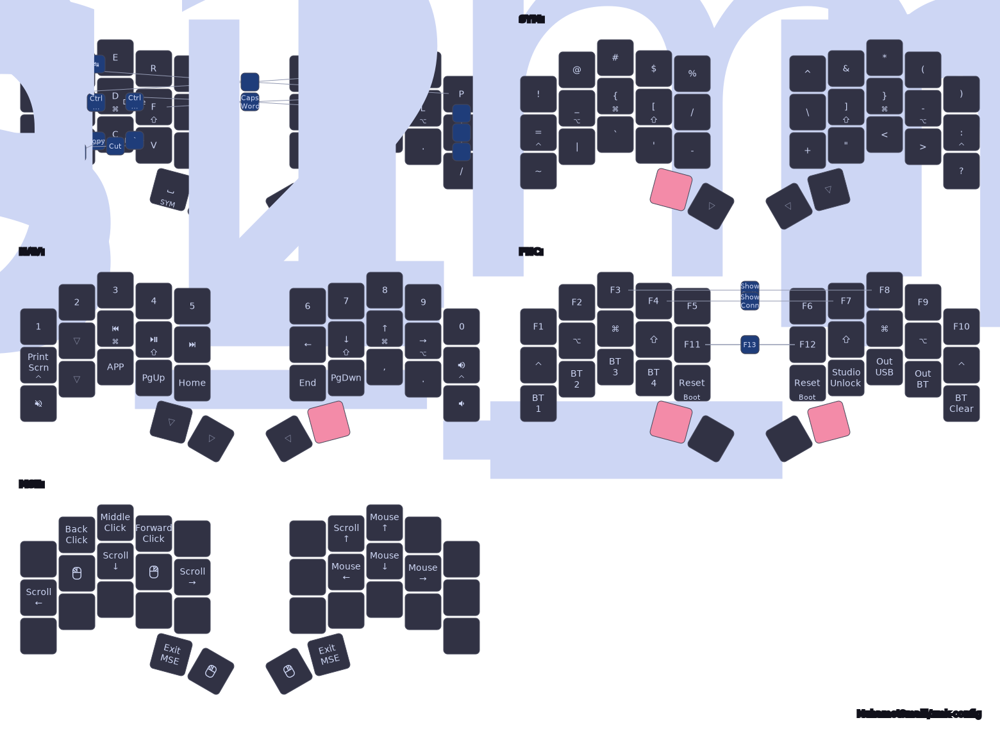

# 34-Key ZMK Layout (Sweep / Urchin / Forager)

| [Ferris Sweep](https://github.com/davidphilipbarr/Sweep)                                                                                  | [Urchin](https://github.com/duckyb/urchin)                                                                                          | [Forager](https://github.com/carrefinho/forager)                                                                                              |
| ----------------------------------------------------------------------------------------------------------------------------------------- | ----------------------------------------------------------------------------------------------------------------------------------- | --------------------------------------------------------------------------------------------------------------------------------------------- |
|  |  |  |

This repo contains my personal [ZMK](https://zmk.dev/) layout for three different 34-key boards. All three share the same logical keymap, while `build.yaml` handles the board-specific firmware targets.

The goal is not to build the most exotic layout possible. It is a pragmatic 34-key setup that stays close to normal QWERTY, keeps programming symbols easy to reach, and smooths over the annoying differences between Linux and macOS.

## What This Layout Optimizes For

- Familiarity first: I want standard QWERTY muscle memory to transfer well.
- Small-board practicality: thumbs and layers do the heavy lifting instead of stretching for distant keys.
- Programming comfort: common symbols and editing actions are close to home row.
- Cross-device consistency: the same layout works across Sweep, Urchin, and Forager.
- Cross-OS consistency: shortcuts and navigation adapt between Linux and macOS.

## Start Here

If you want to understand the repo quickly, read the files in this order:

1. `config/includes/base.dtsi` for the shared layers, hold-taps, macros, and the main keymap.
2. `config/includes/oskey.dtsi` for the Linux/macOS-aware modifiers and navigation helpers.
3. `config/includes/combos.dtsi` for combos.
4. `config/includes/mouse.dtsi` for mouse tuning.
5. `build.yaml` for the actual flash targets.

Notes:

- The Sweep uses the `cradio_*` shield names internally, so some files and generated artifacts still use `cradio`.
- The shared keymap logic lives in `config/includes/`, so changes there apply to all three boards.

## Modules and Why I Use Them

This config uses a few external ZMK modules in addition to upstream ZMK itself.

| Module | Small description | Why I use it here |
| --- | --- | --- |
| [`zmk-case-mode`](https://github.com/MSmaili/zmk-case-mode) | Case-mode behavior for typing identifiers with normal spaces. | I use it for `snake_case`, `camelCase`, and `kebab-case` combos on the base layer so coding-style names are easier on a 34-key board. |
| [`oskey`](https://github.com/mentaldesk/oskey) | OS-aware key behavior for Linux/macOS shortcut differences. | I use it for swapped `Ctrl`/`Cmd` home-row mods, word movement, line movement, and delete-word behavior without maintaining separate keymaps. |
| [`zmk-rgbled-widget`](https://github.com/caksoylar/zmk-rgbled-widget) | RGB LED status indicator module. | I use it for battery and connection indicators on builds that support an RGB LED. |

## Layer Model

- `BASE`: QWERTY, home-row mods, thumb-layer access, and the main daily typing layer.
- `SYM`: symbols and punctuation placed in familiar QWERTY-style positions.
- `NAV`: navigation, numbers, word movement, line movement, delete, and paging.
- `FNC`: function keys, media controls, and the utility layer where I trigger status and OS-selection combos.
- `SYS`: Bluetooth profile control, output switching, reset, bootloader, and ZMK Studio unlock.
- `MSE`: mouse movement, scrolling, clicks, and drag helpers.
- `MSE_FAST`: a faster temporary mouse/scroll layer.

`FNC` is a tri-layer that appears when both `SYM` and `NAV` are active.

`SYS` is intentionally hidden behind `FNC` so reset, Bluetooth, and output controls are harder to trigger by accident.

## Behavior Choices

### Base layer philosophy

- The alpha layout stays intentionally close to standard QWERTY.
- Numbers stay on the top row instead of moving to a more abstract arrangement.
- Symbols try to preserve familiar positions where possible.
- Vim-style directional movement is kept on the navigation layer.

### Home-row mods and thumbs

- Home-row mods are tuned with custom hold-tap settings for cleaner tap vs hold behavior.
- The thumbs carry most of the layout: `SYM/SPACE`, `NAV/BSPC`, `TAB`, and `ENTER`.
- This keeps the main typing area simple while still fitting a full daily-driver workflow into 34 keys.

### Editing and utility combos

Combos are used for actions that are frequent enough to deserve a shortcut but not important enough to consume a dedicated key.

Current combos include:

- editing: `Delete`, `Cut`, `Copy`, `Paste`
- control: `Escape`, `Enter`, `Caps Word`, sticky shift
- casing: `snake_case`, `kebab-case`, `camelCase`
- navigation aid: fast scroll combos
- utility: `Soft Off`, battery indicator, connection indicator, mouse toggle
- OS switching: dedicated macOS and Linux combos on `FNC`

## Build Profiles and Flash Targets

Each keyboard supports two connection modes.

### Dongle mode

- `<keyboard>_dongle`: flash to the dongle
- `<keyboard>_left_peripheral`: flash to the left half
- `<keyboard>_right`: flash to the right half

### Dongleless mode

- `<keyboard>_left_central`: flash to the left half acting as central
- `<keyboard>_right`: flash to the right half

## CI vs Local Builds

### CI

GitHub Actions builds the full matrix from `build.yaml`, including all boards and both dongle and dongleless profiles.

### Local Docker

Use local Docker when iterating on one board.

- `make build KEYBOARD=<sweep|urchin|forager>` builds a single board in dongleless mode
- `make build KEYBOARD=<sweep|urchin|forager> DONGLE=1` builds the dongle profile set
- `make draw KEYBOARD=<sweep|urchin|forager>` regenerates the keymap drawing
- Docker must be running first

```sh
make help

make build KEYBOARD=sweep
make build KEYBOARD=urchin
make build KEYBOARD=urchin DONGLE=1
make build KEYBOARD=forager

make draw KEYBOARD=sweep
make draw KEYBOARD=urchin
make draw KEYBOARD=forager
```

Build notes:

- Local firmware builds read `build.yaml` directly, so local and CI targets stay aligned.
- Firmware outputs are written to `build/local/`.
- Keymap-drawer outputs are written to `tools/keymap-drawer/`.
- The first keymap draw builds a pinned local Docker image for keymap-drawer.

## Layer Map

<p align="center">

</p>

## Credits

- [urob/zmk-config](https://github.com/urob/zmk-config) for home-row mod philosophy and layout ideas
- [caksoylar/zmk-config](https://github.com/caksoylar/zmk-config) for layout structure and keymap-drawer integration
